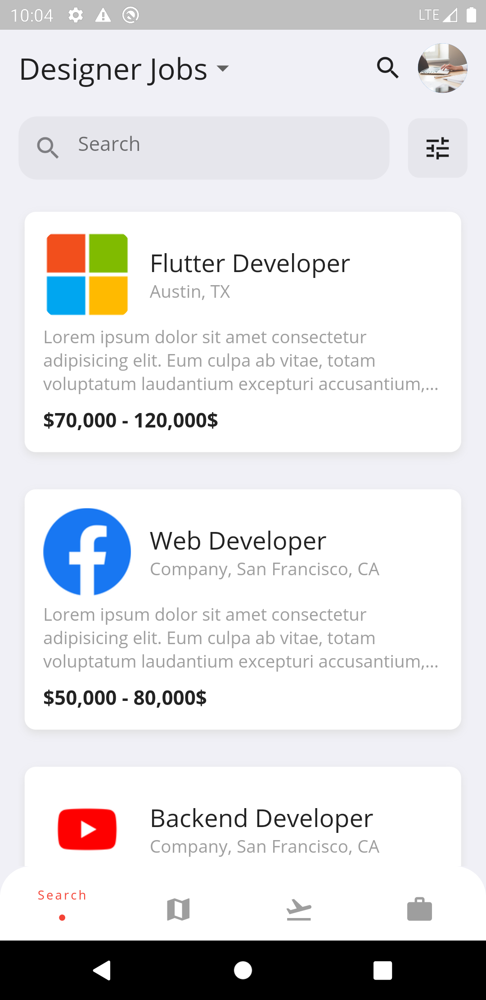
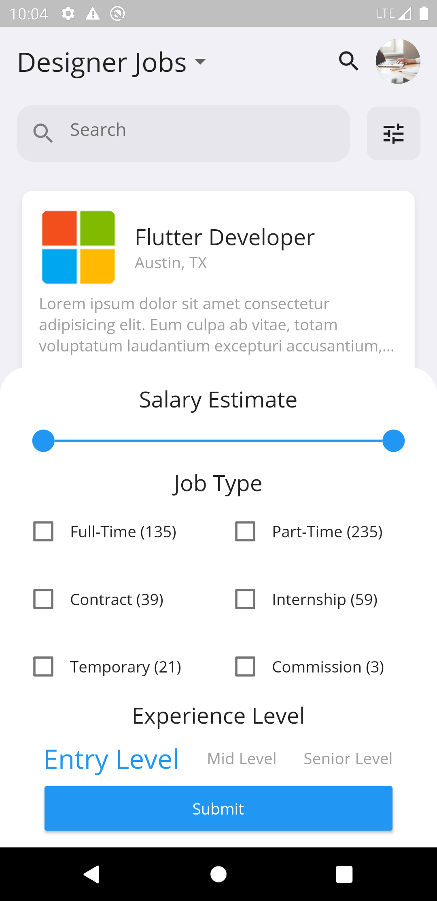
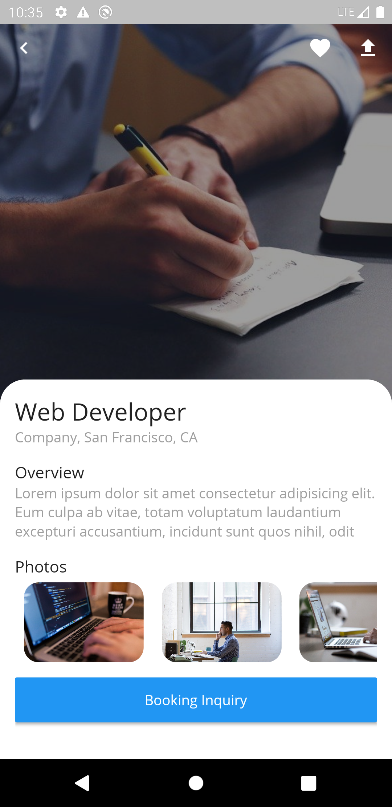

# flutter_job_portal

Original Design: https://cdn.dribbble.com/users/1145170/screenshots/8544212/media/0857b0c376c76571df08eff1af605b0d.mp4

Tutorial: <a href="https://cybdom.tech/">Cybdom Tech</a>

RESULT

## Getting Started

This project is a starting point for a Flutter application.

A few resources to get you started if this is your first Flutter project:

- [Lab: Write your first Flutter app](https://flutter.dev/docs/get-started/codelab)
- [Cookbook: Useful Flutter samples](https://flutter.dev/docs/cookbook)

For help getting started with Flutter, view our
[online documentation](https://flutter.dev/docs), which offers tutorials,
samples, guidance on mobile development, and a full API reference.
